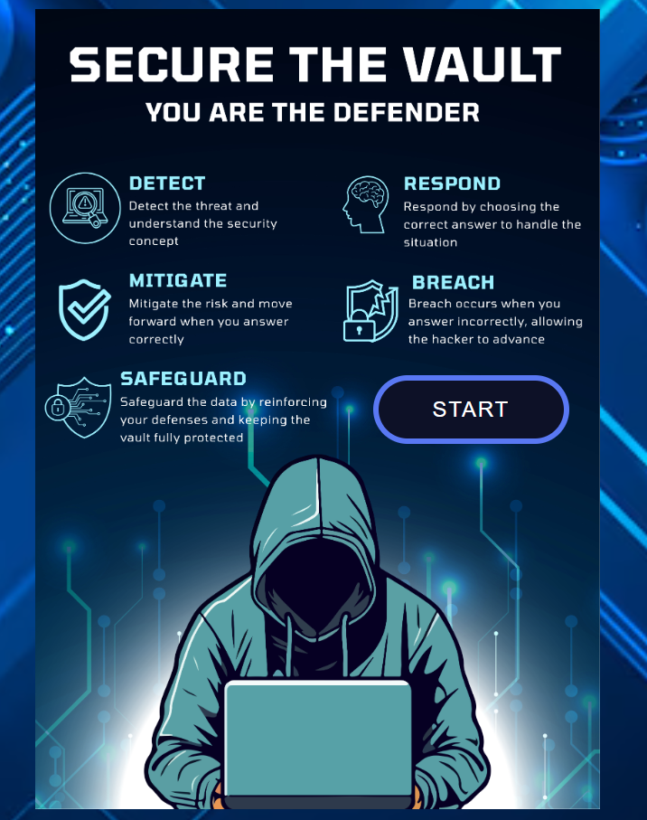

# Secure The Vault 🔐

A fun, beginner-friendly security awareness game where you play as the defender protecting a digital vault from cyber threats.  
Through simple scenarios and multiple-choice questions, players learn how to take the safest actions and build essential cybersecurity skills.

---

## 📸 Screenshot / Logo

---

## 🎮 Game Description

**Game Name:** Secure The Vault

**About the Game:**  
Secure The Vault is an interactive browser-based game designed to teach basic cybersecurity concepts in a simple and engaging way.  
Each stage introduces a *security tip*, a *scenario*, and a *question* where the player must choose the correct secure action to protect the vault.

**Why This Game:**  
The goal of this project is to make cybersecurity easier, more fun, and less intimidating—especially for beginners.  
This project also served as a great opportunity to practice and apply JavaScript, HTML, and CSS.

---

## 🚀 Getting Started

### ▶️ Play the Game  
**Deployed Link:**  
(https://shahado09.github.io/SecureTheVault-game/)

### 🖥️ How to Play
1. Click **Start** to begin.
2. Read the **security tip**, **scenario**, and **question** displayed in the modal.
3. Choose one of the available options.
4. The game will show whether your choice was correct and explain why.
5. Progress through the stages (Detect → Respond → Mitigate → Safeguard → Breach).

